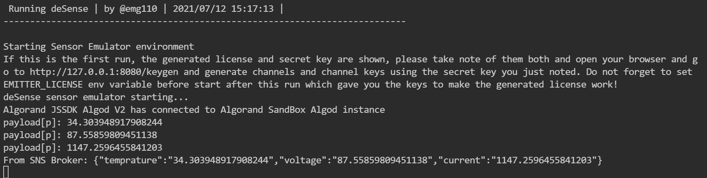

# deSense
## Sensor Networks on Algorand

> Provided for Algorand developer portal by [@emg110](https://github.com/emg110) and [@sheghzo](https://github.com/sheghzo).

## IMPORTANT NOTE:

### This library and the main solution deSense are made as proof of concept development projects with production and enterprise in mind, so all teal programs included are consisted of simple `int 1` code to pass everything which suites the development enviromnet where the possibility of implementation is the target not showing off TEAL capabilities which are huge but off the subject for this library.

## Usefull links

> [Sensor Emulator](https://github.com/emg110/sensor-emulator)

> [deSense on Algorand Developers Portal](https://developer.algorand.org/solutions/sensor-networks-on-algorand-blockchain/)

## Technical notes

> Run `./desense.sh help` to see available flows and commands

> Run `./desense.sh install` first , then  `./desense.sh startsandbox`, then  `./desense.sh startemitter` and finally, then  `./desense.sh start emulator` as order of running things but read forward through technical notes first!

> It'srecommended to run emitter and emulator in different bash terminals than main one, for they have continius logging of published and received sensor data which may interfere with user experience!

> When running `./desense.sh startemitter` for the first time you will be given just generated a license and a secret code for a new registered sensor netwrok on your localhost.

Take note of these two and set EMITTER_LICENSE environment variable:

`export EMITTER_LICENSE="PfA8IHtI_zkp1tEGEG3T86--Gy6bexPlMVxzi3o4_aEMGBCfEK7GTYaxmK6Zche0DLQfMDamuYnxC9XB9p8BAQ:3"`

Open your browser and go to Sensor Network registeration panel `http://127.0.0.1:8080/keygen` and register your channel name `/desense` to get a channel key.

Use the channel key you just received from keygen and set it in key configuration of your sensor emulator `sensor-template-config.json`. Along with channel key set the port of your sensor network e.g 8080 and also paste the sensor network license mentioned above into the license configuration. Make sure you do these configurations before starting emulator with `./desense startemulator` command.

> If the setup is OK then by starting sensor emulator via `./desense startemulator` this should be the output:

## Design Info

> 

> 

> 

## Presentation Video

> 

## Sensor Emulator Screen Cast

> 

## Based on amazing libraries and examples of

> [EmitterIO](https://github.com/emitter-io/emitter)

> [Sampler](https://github.com/sqshq/sampler)

> [mqtt-emulator](https://github.com/dojot/mqtt-emulator)-----> Forked and extensively modified & overhauled version created just for this Hackathon [sensor-emulator](https://github.com/emg110/sensor-emulator).
